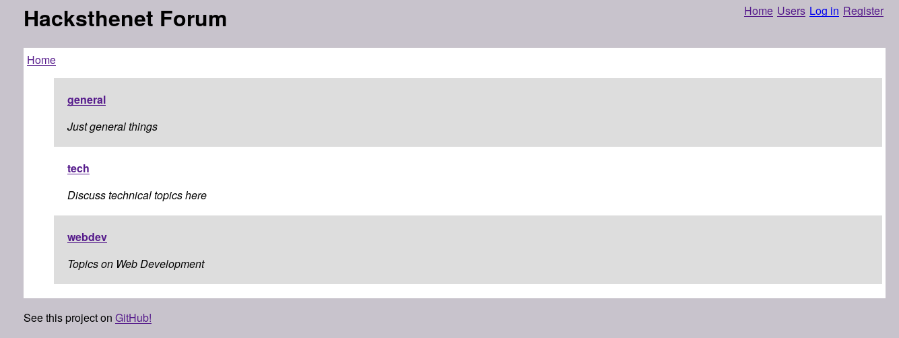
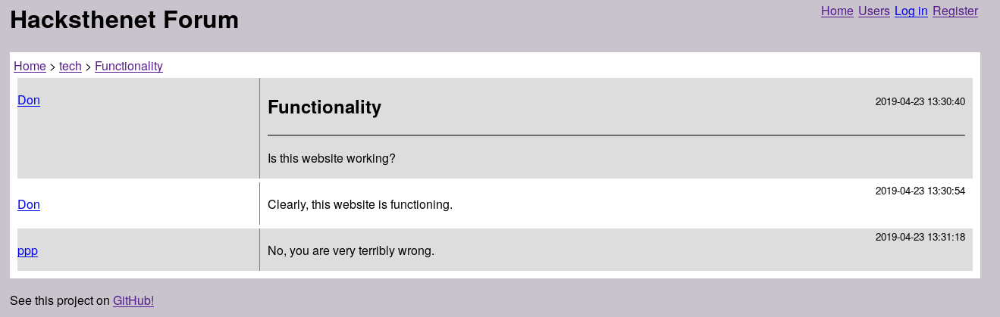

# Hacksthenet Forums

Forum engine built in Common Lisp + Hunchentoot for the [Hacks the
Internet](https://uwbhacks.com/) event from [UWB
ACM](https://uwbacm.com/).

---





Hacksthenet Forums is an 8-hour project that started at 1:30pm. The
website features account registration and authentication (though no
password encryption!), creating threads, and replying to threads.

## Usage

This project assumes SBCL as the Common Lisp interpreter, and requires
Quicklisp to work properly. To run:

```sh
$ cd hacksthenet-forums
$ sbcl
* (load "hacksthenet.lisp")
* (hacksthenet:start-demo)
```

This runs the forum with a pre-made list of topics:

- general - Just general thigns
- tech - Discuss techincal topics here
- webdev - Topics on Web Development

And three accounts: admin, system, and moderator. No accounts feature
any ability to moderate or administrate on the website.
